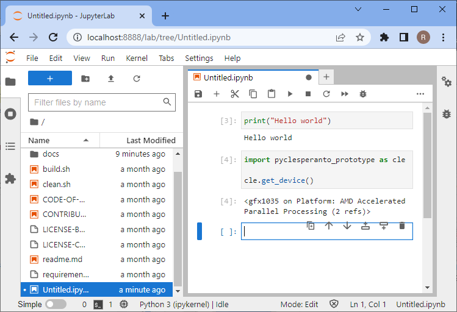

# 设置你的计算机

本章提供了设置计算机以运行Python进行图像分析的说明。

# 设置Python和Conda环境
在使用Python时，我们将使用许多需要组织的插件和软件库。
实现这一点的一种方法是管理*Conda*环境。
Conda环境可以被视为一个虚拟桌面或虚拟计算机，可通过终端访问。
如果你在一个Conda环境中安装了一些软件，它可能无法从另一个环境中访问。
如果Conda环境出现问题，例如安装了不兼容的软件，你可以直接创建一个新环境重新开始。

另请参阅
* [Mambaforge和Python入门](https://biapol.github.io/blog/mara_lampert/getting_started_with_mambaforge_and_python/readme.html)
* [使用Conda、Mamba和其他工具管理科学Python环境](https://focalplane.biologists.com/2022/12/08/managing-scientific-python-environments-using-conda-mamba-and-friends/)
* [使用Python进行科学数据分析](https://youtu.be/MOEPe9TGBK0)

## 步骤1：安装Mambaforge
下载并安装Conda。我们推荐使用Conda发行版[Mambaforge](https://github.com/conda-forge/miniforge#mambaforge)。

为了便于使用，建议仅为你个人安装，并在安装过程中将Conda添加到PATH变量中。


## 步骤2：安装devbio-napari

我们建议安装[devbio-napari](https://github.com/haesleinhuepf/devbio-napari)，这是一个带有一套生物图像分析插件的napari发行版。

在终端中使用以下命令：

```
mamba create --name devbio-napari-env python=3.9 devbio-napari -c conda-forge
```

**提示**：建议为你执行的每个项目创建一个环境。
这样，已安装的软件库和工具就不会相互影响。

## 步骤3：测试安装

之后，你可以进入环境开始工作。
每当你想再次在同一项目上工作时，你应该启动命令行并输入以下内容：

```
mamba activate devbio-napari-env
```

从终端启动[Jupyter lab](https://jupyter.org/)，如下所示：

```
jupyter lab
```

浏览器将打开并显示以下网页。在"Notebook"部分，点击"Python 3 (ipykernel)"以创建一个新的笔记本：


在新笔记本中，点击第一个代码单元，输入`print("Hello world")`并按下键盘上的SHIFT+ENTER。
如果一切安装正确，应该如下所示：


要测试你的显卡驱动程序是否正确安装，请输入以下代码：

```
import pyclesperanto_prototype as cle

cle.get_device()
```



## 故障排除：显卡驱动程序

如果错误消息包含"ImportError: DLL load failed while importing cl: The specified procedure could not be found"[另见](https://github.com/clEsperanto/pyclesperanto_prototype/issues/55)或"clGetPlatformIDs failed: PLATFORM_NOT_FOUND_KHR"，请为你的显卡和/或OpenCL设备安装最新驱动程序。

根据你的硬件从此列表中选择正确的驱动程序来源：

* [AMD驱动程序](https://www.amd.com/en/support)
* [NVidia驱动程序](https://www.nvidia.com/download/index.aspx)
* [Intel GPU驱动程序](https://www.intel.com/content/www/us/en/download/726609/intel-arc-graphics-windows-dch-driver.html)
* [Intel CPU OpenCL驱动程序](https://www.intel.com/content/www/us/en/developer/articles/tool/opencl-drivers.html#latest_CPU_runtime)
* [Microsoft Windows OpenCL支持](https://www.microsoft.com/en-us/p/opencl-and-opengl-compatibility-pack/9nqpsl29bfff)

有时，Mac用户需要安装以下内容：

    mamba install -c conda-forge ocl_icd_wrapper_apple

有时，Linux用户需要安装以下内容：

    mamba install -c conda-forge ocl-icd-system

## 故障排除：DLL加载失败

如果出现以下错误消息：
```
[...] _get_win_folder_with_pywin32
from win32com.shell import shellcon, shell
ImportError: DLL load failed while importing shell: The specified procedure could not be found.
```

请尝试在base环境中运行以下命令：

```
conda activate base

pip install --upgrade pywin32==228
```

[来源](https://github.com/conda/conda/issues/11503)