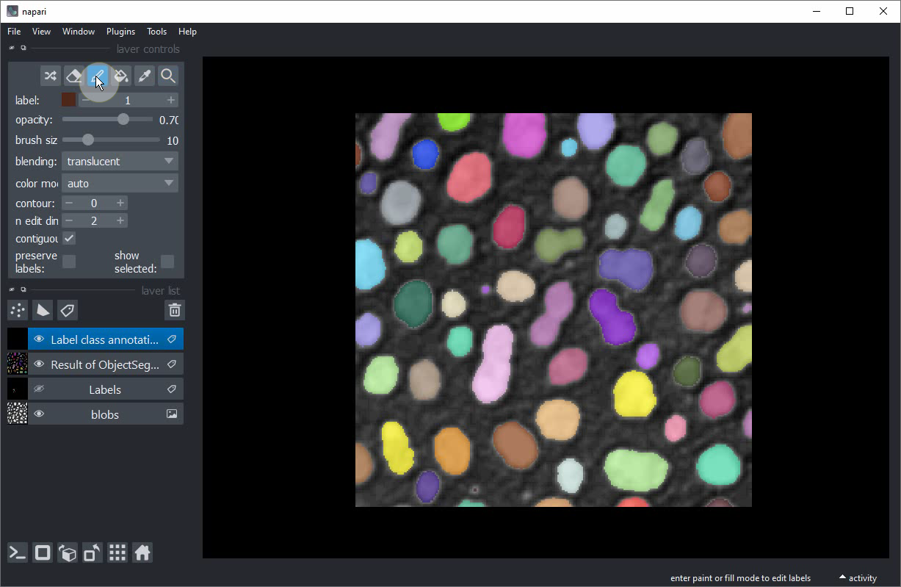
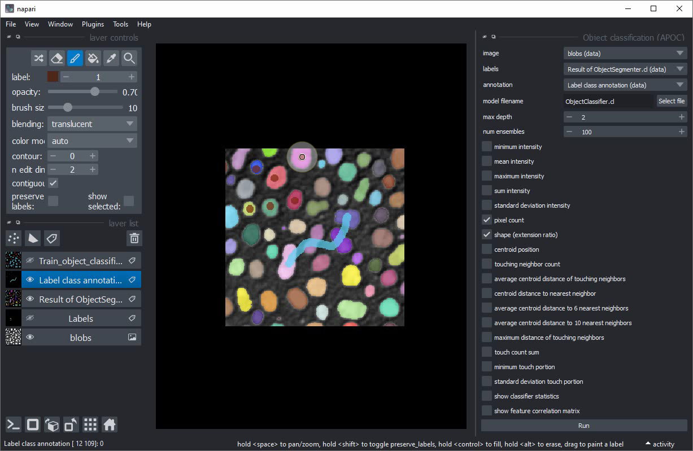

# Napari中的交互式对象分类

在本练习中,我们将训练[随机森林分类器](https://en.wikipedia.org/wiki/Random_forest)来对分割的对象进行分类。
我们将使用napari插件[napari-accelerated-pixel-and-object-classification](https://www.napari-hub.org/plugins/napari-accelerated-pixel-and-object-classification)。

## 开始

打开终端窗口并激活你的conda环境:

```
conda activate devbio-napari-env
```

然后,启动Napari:

```
napari
```

从菜单`File > Open Sample > clEsperanto > Blobs (from ImageJ)`加载"Blobs"示例数据集

我们还需要一个标签图像。你可以使用[之前训练的像素分类器](machine_learning:pixel_classification)创建它,
或者使用菜单`Tools > Segmentation / labeling > Gauss-Otsu Labeling (clesperanto)`。

## 对象分类

我们的起点是一个加载的图像和一个带有分割对象的标签图像。以下过程也在[这个视频](apoc_object_classification.mp4)中展示。


添加另一个标签图像。将标签图像重命名为`Label class annotation`,以免与其他图像混淆。


激活`Brush tool`。


用标签`1`在小的圆形对象上放置小点(出于训练目的:真的只是较小的对象)。


将`label`增加到`2`。


在图像中心较大的细长对象上画一条线。


从菜单`Tools > Segmentation post-processing > Object classification (APOC)`启动对象分类工具


在这个用户界面中,激活`shape`复选框。


选择`image`、`labels`和`annotation`,如下所示:


点击`Run`。一秒钟后,应该出现一个新的标签层,带有棕色/蓝色注释的对象。一些较大的圆形对象会无意中变成蓝色。


隐藏新创建的分类层。


选择你的注释层。


注释更多的圆形对象,这次是较大的对象。


再次训练分类器。


如果你对训练好的分类器满意,将文件复制到安全的地方。当训练下一个分类器时,这个可能会被覆盖。

## 额外练习
重新训练分类器,使其能够区分三个不同的类别:
* 小圆形对象
* 大圆形对象
* 大细长对象